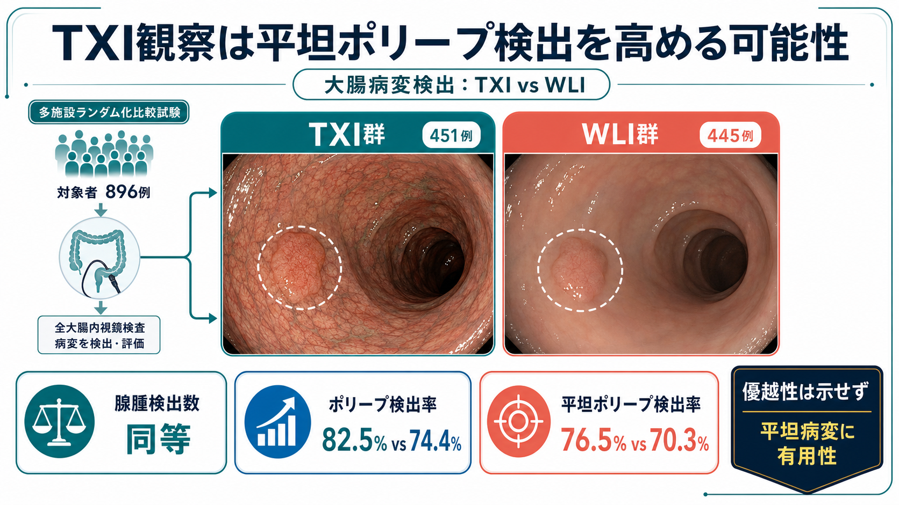
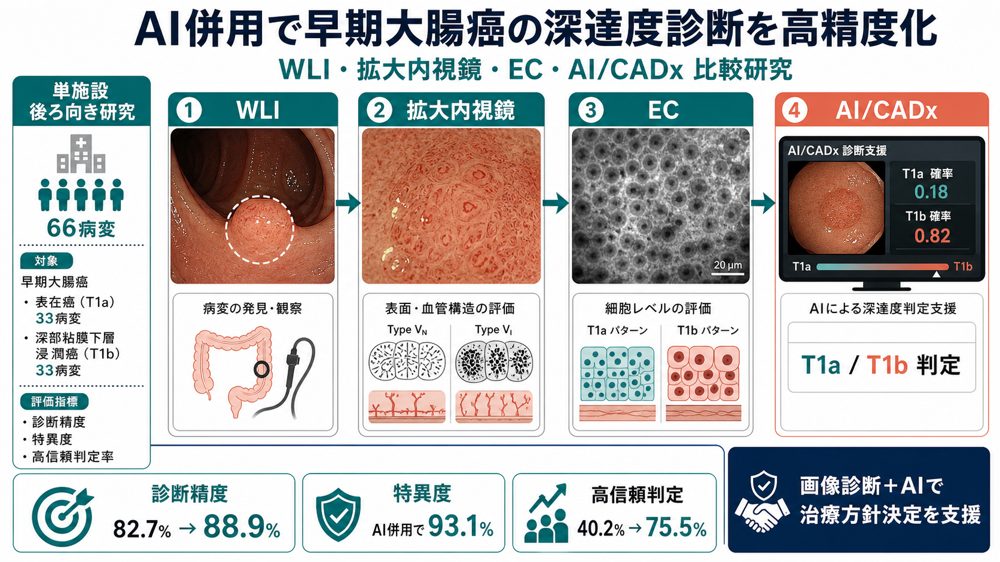

# Graphical Abstract

Japanese graphical abstract for PubMed PMID 40113100.

- Article: The Efficacy of Texture and Color Enhancement Imaging Observation in the Detection of Colorectal Lesions: A Multicenter, Randomized Controlled Trial (deTXIon Study).
- PubMed: https://pubmed.ncbi.nlm.nih.gov/40113100/
- DOI: https://doi.org/10.1053/j.gastro.2025.03.007

## PMID 41262550

- Article: White Light, Magnifying Endoscopy, Endocytoscopy, and Artificial Intelligence in Diagnosis of Early Colorectal Cancer: A Comparative Study.
- PubMed: https://pubmed.ncbi.nlm.nih.gov/41262550/
- DOI: https://doi.org/10.1002/deo2.70240

